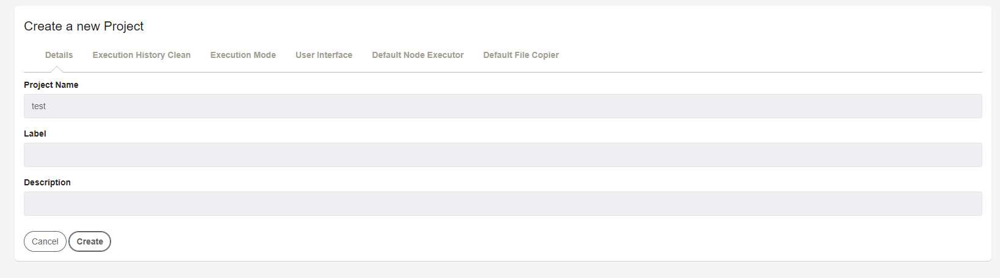

# Rundeck

## 安裝

參考官方的<a href="https://docs.rundeck.com/docs/administration/install/linux-rpm.html#open-source-rundeck">installing on CentOS</a>以及<a href="https://docs.rundeck.com/downloads.html">Downloads</a>

### 安裝java
```
yum install java-1.8.0
```

### yum rpm 安裝 rundeck
```
rpm -Uvh https://repo.rundeck.org/latest.rpm
yum install rundeck
```

### 開啟rundeck
```
service rundeckd start
```

### 驗證服務是否正確啟動
```
tail -f /var/log/rundeck/service.log
```

### 看到類似以下內容的服務即已準備就緒
```
Grails application running at http://localhost:4440 in environment: production
```

## 配置

### Rundeck檔案位置

安裝完成後

- 配置檔位置:
```
/etc/rundeck
```
- 程式檔位置:
```
/var/lib/rundeck
```

### 修改配置檔IP

修改/etc/rundeck/rundeck-config.properties
```
grails.serverURL=http://122.147.213.60:4440
```

修改/etc/rundeck/framework.properties
```
framework.server.name = localhost
framework.server.hostname = localhost
framework.server.port = 4440
framework.server.url = http://122.147.213.60:4440
```

關閉SELinux
```
sudo vi /etc/sysconfig/selinux
reboot 
```

開啟防火牆4440port
```
firewall-cmd --add-port=4440/tcp --permanent
firewall-cmd --reload
```

## 初步教學

### 訪問Web GUI

訪問 http://{ip/domain}:4440

預設帳號與密碼皆為admin

### 建立專案Project

登入後會看到首頁長這樣(v3.2.6)，點選New Project+建立新專案
<br>

如果沒有特別的配置填好專案名稱就可以按Create
<br>

### 建立節點Node

建立好專案後，預設會先請你編輯你的節點(Node)，上面已經幫你建立了local的節點就是這台Server
需要建立節點按下Add a new Node Source按鈕
<br>

這裡我們先選擇由檔案產生節點
<br>

文件的配置
File Path填入專案的名稱方便辨識
```
/var/lib/rundeck/projects/{your_project_name}/etc/resource.xml
```
<br>

建立成功後就可以在/var/lib/rundeck/projects下看到我們產生的檔案
打開resource.xml會長的像下面這樣
```
<?xml version="1.0" encoding="UTF-8"?>

<project>
  <node name="localhost" description="Rundeck server node" tags="" hostname="localhost" osArch="amd64" osFamily="unix" osName="Linux" osVersion="3.10.0-1062.el7.x86_64" username="rundeck"/>
</project>
```
- name: 節點名稱
- description: 描述
- tags: 標籤
- hostname: ip或domain
- username: 用哪個使用者登入

想要新增節點就在<project></project>新增一行<node ...></node>

然後點選左側的Node選項就可以看到配置在文件裡的節點

### 建立工作Job

點選左側欄位進入Job選單，並點選建立新的工作
<br>

先填寫Job的名稱，並到Workflow做設定
<br>

這邊選擇command並輸入whoami
<br>

建立好Job後，按下剛剛建立的Job並再跳出的視窗按下Run Job Right執行Job，就會看到執行的結果
<br>


## Rundeck 和 Ansible

### rundeck-ansible-plugin

官方表示
```
Rundeck makes Ansible even better
```
因為在Rundeck的社區裡很多人表示喜歡把Rundeck 和 Ansible一起使用，所以官方也推出了<a href="https://github.com/Batix/rundeck-ansible-plugin">rundeck-ansible-plugin</a>


### 安裝

1. <a href="https://github.com/Batix/rundeck-ansible-plugin/releases">下載最新版的.jar檔</a>
2. 把.jar檔案放在/var/lib/rundeck/libext下
3. 修改/etc/ansible/ansible.cfg
```
[defaults]
host_key_checking=false
```
4. 如果使用SSH公鑰連結節點的使用者請將/var/lib/rundeck/.ssh/id_rsa.pub配置給子節點，用法請參考<a href="https://github.com/leoa12412a/Ansible/blob/master/README.md#%E4%BD%BF%E7%94%A8ssh%E5%85%AC%E9%91%B0%E6%86%91%E8%AD%89">這裡</a>

### 測試 
測試rundeck是否可以訪問Ansible的配置文件和密鑰
```
su rundeck -s /bin/bash -c "ansible all -m ping"
```
如果無法成功的話可以參考<a href="https://github.com/Batix/rundeck-ansible-plugin#requirements">官方文件</a>

### 網頁上的配置
建立一個新專案，並在Default Node Executor選擇Ansible Ad-Hoc Node Executor，且配置如下
<br>

並在Edit Nodes以Ansible Resource Model Source的方式新建Node source
<br>

配置Ansible的節點檔案和配置檔
<br>

就可以看到Ansible裡的節點
<br>


